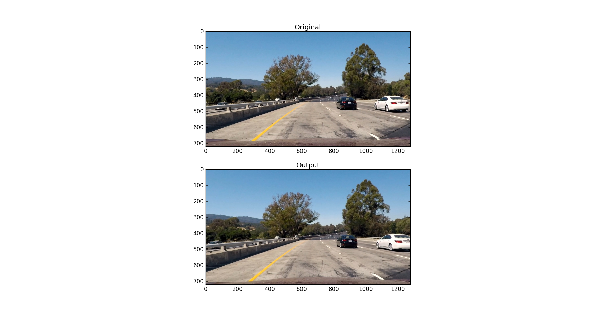
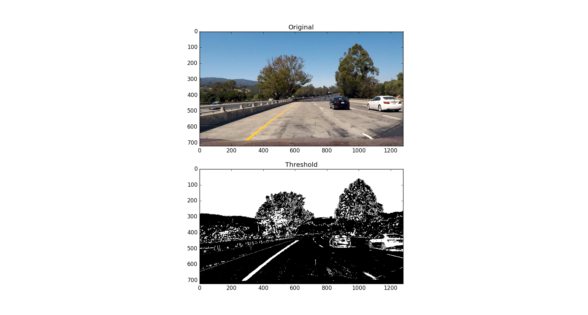
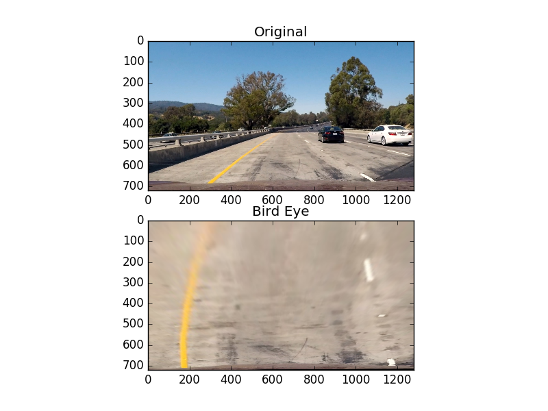
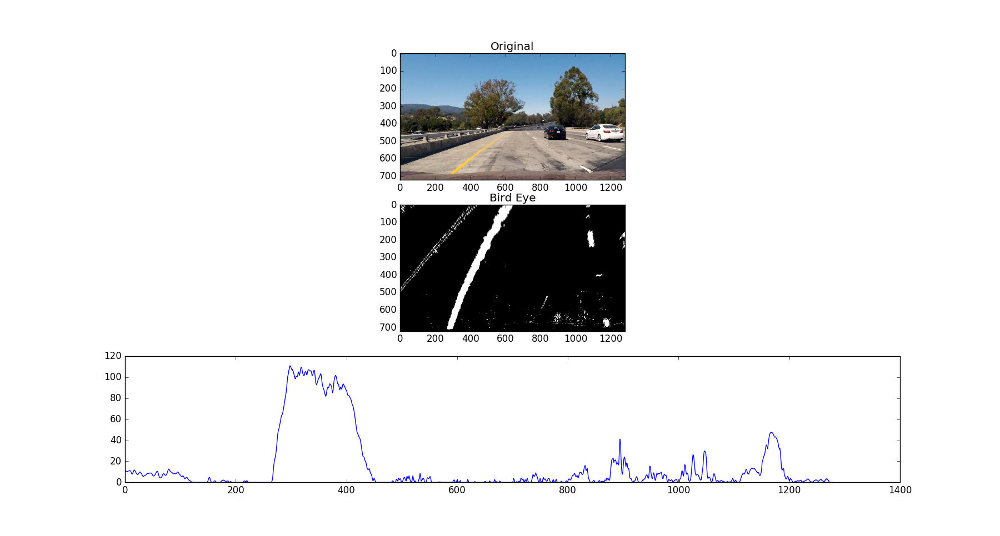

##Solution

---

**Advanced Lane Finding Project**

###Camera Calibration

####1. Briefly state how you computed the camera matrix and distortion coefficients. Provide an example of a distortion corrected calibration image.

The code for this step is in solutions.py in both methods: get_points() and cal_undistort()

get_points() loads a list of calibration images, and go over each image, convert the image to gray, and then finds the chess board corners in the image and stores them in imgpoints.
An adjacent list called objpoints will contain the chess board corners as they should be located on a chess board.

cal_undistort() will be given the image, and both these points (imgpoints, objpoints) and the camera will be calibrated based on this information (The image, where the corners are, where the corners should be).
This will return the undistorted image.

####2. Describe how (and identify where in your code) you used color transforms, gradients or other methods to create a thresholded binary image.  Provide an example of a binary image result.

The code for this step is in solution.py in threshold, abs_sobel_thresh, mag_threshold and hsv_threshold

abs_sobel_thresh does sobel threshold on an image in any direction x or y. The image is first converted into gray scale, then sobel threshold is applied with a given threshold.
In this case, we did did both x sobel with threshold (20, 100) and y sobel with threshold (20, 100).

mag_threshold does magnitude threshold on an image by first converting the image into gray scale, then doing sobel x and sobel y and calculating gradient magnitude as sqrt(sobelx^2, sobely^2) and a scale factor of maximum value of gradient magnitude / 255. Then our final gradient magnitude is the gradient magnitude divided by the scale factor. The threshold given is then applied to that.
In this case, we did a magnitude threshold of (30, 100).

hsv_threshold converts the image to HSV color space and then applies a given threshold on the S channel. In this case the threshold applied is (100, 255).

The final image output is composed of:
Either (abs_sobel_thresh of 1 for x and abs_sobel_thresh of 1 for y)
or (mag_threshold of 1 and abs_sobel_thresh of 1 for x)
or (hsv_threshold of 1)

####3. Describe how (and identify where in your code) you performed a perspective transform and provide an example of a transformed image.

The code for this step is in solution.py in transform.
transform takes source and destination points and gets the transformation matrix and then transforms the image.
In this case, src and dst were retrieved from the image below:

The following source and destination were retrieved from the image above:

| Source        | Destination   | 
|:-------------:|:-------------:| 
| 300, 707      | 209, 713      |
| 580, 463      | 203, 60       |
| 750, 463      | 1134, 37      |
| 1146, 707     | 1191, 707     |

By applying the transform method with these source and destination points, we change the prespective into a bird eye view prespective as can be seen in the following image:

####4. Describe how (and identify where in your code) you identified lane-line pixels and fit their positions with a polynomial?

The following histogram shows the sum of the pixel values over the lower half of the bird eye view, and it shows two spikes where the lanes are at.

Then I did some other stuff and fit my lane lines with a 2nd order polynomial kinda like this:

![alt text][image5]

####5. Describe how (and identify where in your code) you calculated the radius of curvature of the lane and the position of the vehicle with respect to center.

I did this in lines # through # in my code in `my_other_file.py`

####6. Provide an example image of your result plotted back down onto the road such that the lane area is identified clearly.

I implemented this step in lines # through # in my code in `yet_another_file.py` in the function `map_lane()`.  Here is an example of my result on a test image:

![alt text][image6]

---

###Pipeline (video)

####1. Provide a link to your final video output.  Your pipeline should perform reasonably well on the entire project video (wobbly lines are ok but no catastrophic failures that would cause the car to drive off the road!).

Here's a [link to my video result](./project_video.mp4)

---

###Discussion

####1. Briefly discuss any problems / issues you faced in your implementation of this project.  Where will your pipeline likely fail?  What could you do to make it more robust?

Here I'll talk about the approach I took, what techniques I used, what worked and why, where the pipeline might fail and how I might improve it if I were going to pursue this project further.  

