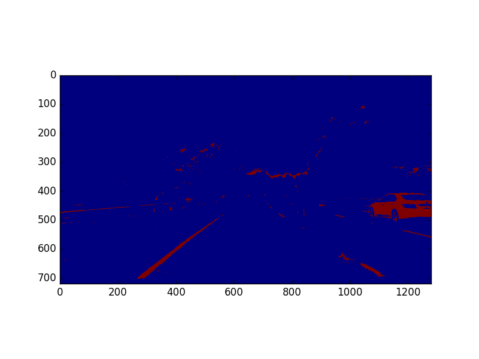
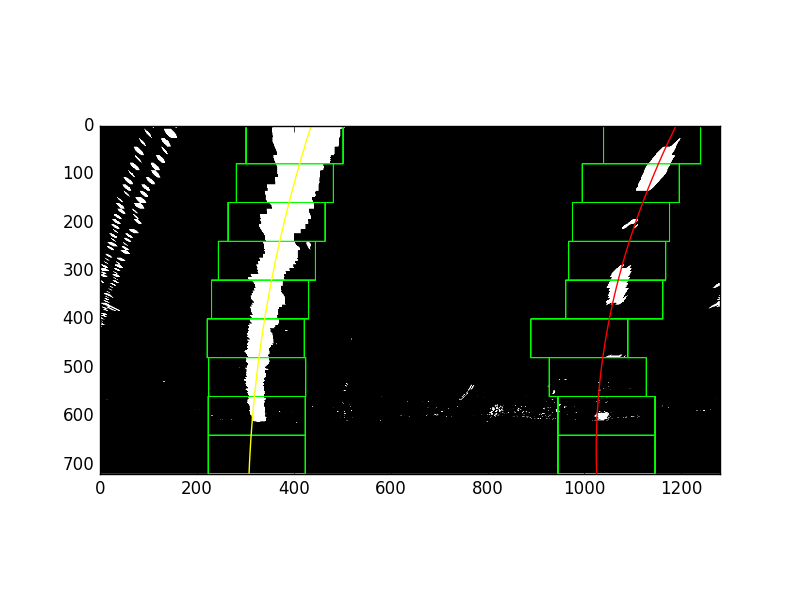
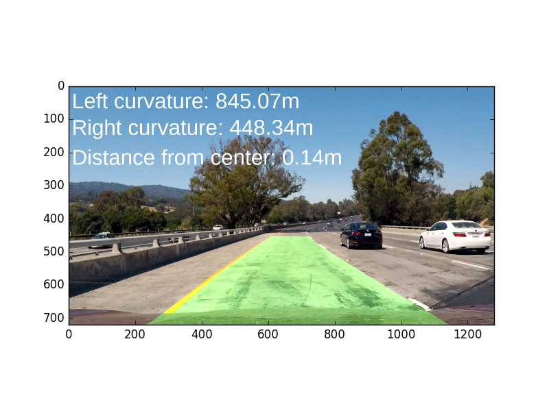

##Solution

---

**Advanced Lane Finding Project**

###Camera Calibration

####1. Briefly state how you computed the camera matrix and distortion coefficients. Provide an example of a distortion corrected calibration image.

The code for this step is in solutions.py in both methods: get_points() and cal_undistort()

get_points() loads a list of calibration images, and go over each image, convert the image to gray, and then finds the chess board corners in the image and stores them in imgpoints.
An adjacent list called objpoints will contain the chess board corners as they should be located on a chess board.

cal_undistort() will be given the image, and both these points (imgpoints, objpoints) and the camera will be calibrated based on this information (The image, where the corners are, where the corners should be).
This will return the undistorted image.

The following shows an example of a distortion calibration image and after it is being undistorted:

The following shows an example of a road image before and after calibration:

####2. Describe how (and identify where in your code) you used color transforms, gradients or other methods to create a thresholded binary image.  Provide an example of a binary image result.

Current Try:

The code for this step is in solution.py in threshold which calls color_threshold:
color_threshold aims to get the yellow and white lane lines by multiple methods:
1. extract the yellow lanes by getting parts of the image that match the range (20, 100, 100) - (50, 255, 255) in HSV
2. extract the white lanes by getting parts of the image that match the range (0, 0, 187) - (255, 20, 255) in HSV
3. extract the white lanes by getting parts of the image that match the range (0, 195, 0) - (255, 255, 60) in HSL
4. extract the white lanes by getting parts of the image that match the range (200, 200, 200) - (255, 255, 255) in RGB
The result is the or of all the previous.

The following image shown below is the result of applying this:

My previous try which did not work as well as this one is the following:

The code for this step is in solution.py in threshold, abs_sobel_thresh, mag_threshold and hsv_threshold

abs_sobel_thresh does sobel threshold on an image in any direction x or y. The image is first converted into gray scale, then sobel threshold is applied with a given threshold.
In this case, we did did both x sobel with threshold (20, 100) and y sobel with threshold (20, 100).

mag_threshold does magnitude threshold on an image by first converting the image into gray scale, then doing sobel x and sobel y and calculating gradient magnitude as sqrt(sobelx^2, sobely^2) and a scale factor of maximum value of gradient magnitude / 255. Then our final gradient magnitude is the gradient magnitude divided by the scale factor. The threshold given is then applied to that.
In this case, we did a magnitude threshold of (30, 100).

hsv_threshold converts the image to HSV color space and then applies a given threshold on the S channel. In this case the threshold applied is (100, 255).

The final image output is composed of:
Either (abs_sobel_thresh of 1 for x and abs_sobel_thresh of 1 for y)
or (mag_threshold of 1 and abs_sobel_thresh of 1 for x)
or (hsv_threshold of 1)

The following image below is the result of applying this:

####3. Describe how (and identify where in your code) you performed a perspective transform and provide an example of a transformed image.

The code for this step is in solution.py in transform.
transform takes source and destination points and gets the transformation matrix and then transforms the image.
In this case, src and dst were retrieved from the image below:

The following source and destination were retrieved from the image above:

| Source        | Destination   | 
|:-------------:|:-------------:| 
| 585, 456      | 300, 70       |
| 699, 456      | 1000, 70      |
| 1029, 667     | 1000, 600     |
| 290, 667      | 300, 600      |

By applying the transform method with these source and destination points, we change the prespective into a bird eye view prespective as can be seen in the following image:

####4. Describe how (and identify where in your code) you identified lane-line pixels and fit their positions with a polynomial?

The following histogram shows the sum of the pixel values over the lower half of the bird eye view, and it shows two spikes where the lanes are at.

solution.py has the method full_detect_lane_lines() which takes the image, creates a histogram shown above which has the sum of the values in the image up to half of its height.
We get the maximum value up to the midpoint and recognize this as the left lane starting point, and then the maximum value from the midpoint until the endpoint and then recognize this as the right lane starting point.

We then create 9 windows over the height of the image for the left lane and the right lane.
For each window, we define the height it should be created at, and we use the the starting point we calculated before and calculate a box around it with a margin.
We then identify the left lane to be the nonzero indices within the left windows and the right lane to be the nonzero indices within the right windows.
Afterwards, we call get_lane_fit() on the lane which calculates the polynomial fit for these indices.

The picture below shows the boxes and the lines through the lanes:

####5. Describe how (and identify where in your code) you calculated the radius of curvature of the lane and the position of the vehicle with respect to center.

in lane.py, the method curvature() calculates the curvature of the lane.
The curvature of the line is computed as (1 + first_order_derivative_of_line_fit(y)^2)^1.5 / absolute(second_order_derivate_of_line_fit(y)) where y is the image height.

The distance from the center is computed as:
 let A be the dot product of the center point (height / 2, width) and TO_METER which is an array of the x meters per pixel and y meters per pixel
 let B be the first order derivate of the line to fit the left lane
 let C be the first order derivate of the line to fit the right lane

 The distance from the center is ((B + C) / 2) - A

####6. Provide an example image of your result plotted back down onto the road such that the lane area is identified clearly.

In solution.py overlay_lane(), the image is given, the line fitting the left lane, the line fitting the right lane and a top down transform.
overlay_lane() creates a line on the left and a line on the right and overlays between the lane with a green shade.

This can be seen in the picture below:

---

###Pipeline (video)

####1. Provide a link to your final video output.  Your pipeline should perform reasonably well on the entire project video (wobbly lines are ok but no catastrophic failures that would cause the car to drive off the road!).

The pipeline is created in def convert_video() by calling full_pipeline on each image in the video which performs the operations described above.
Here is the video output:

Here's a [link to my video result](https://youtu.be/OHRQfqGtE8I)

---

###Discussion

####1. Briefly discuss any problems / issues you faced in your implementation of this project.  Where will your pipeline likely fail?  What could you do to make it more robust?

In the challenge video, my pipeline shows some issues: some of the images has incorrect lanes detected.
I noticed that shadow (from a bridge) and approaching the road divider particularly confuses the pipeline.

The following are things that could be improved:
1. smoothing algorithm that takes into consideration lanes from previous frame, so if the current lane is very different from the previous frames, it would dismiss it.
2. source points for bird view transformation close enough to the lane positions so it won't include the road divider if it was approached.
3. better smoothing the vertical windows in each lane, so if one window is way off, then it won't be included.