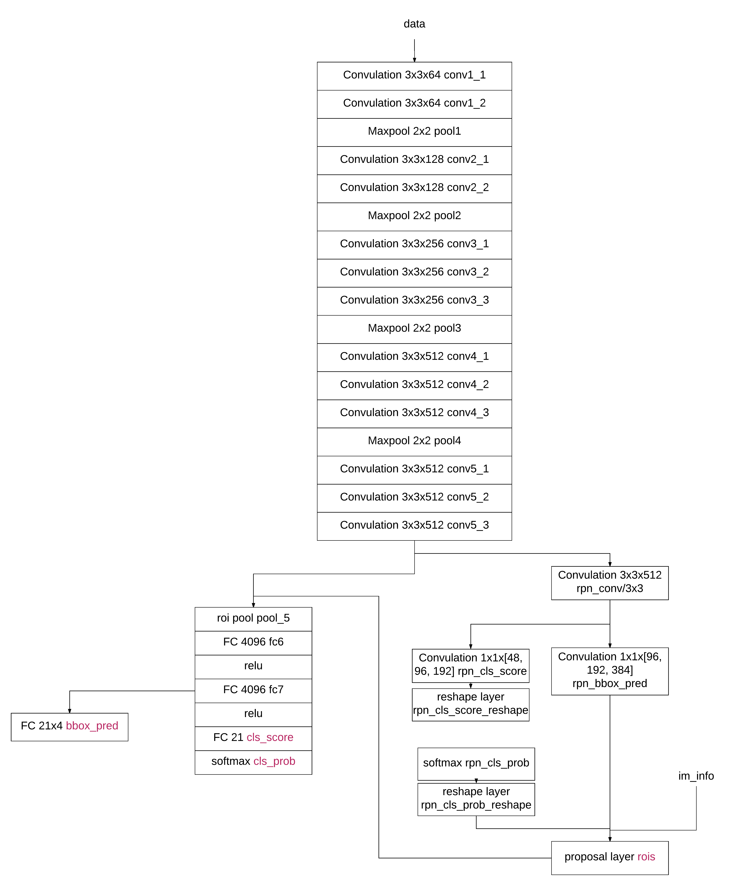
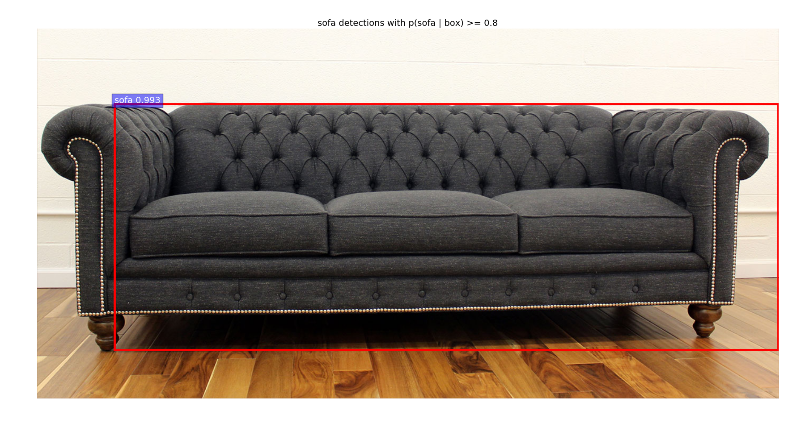
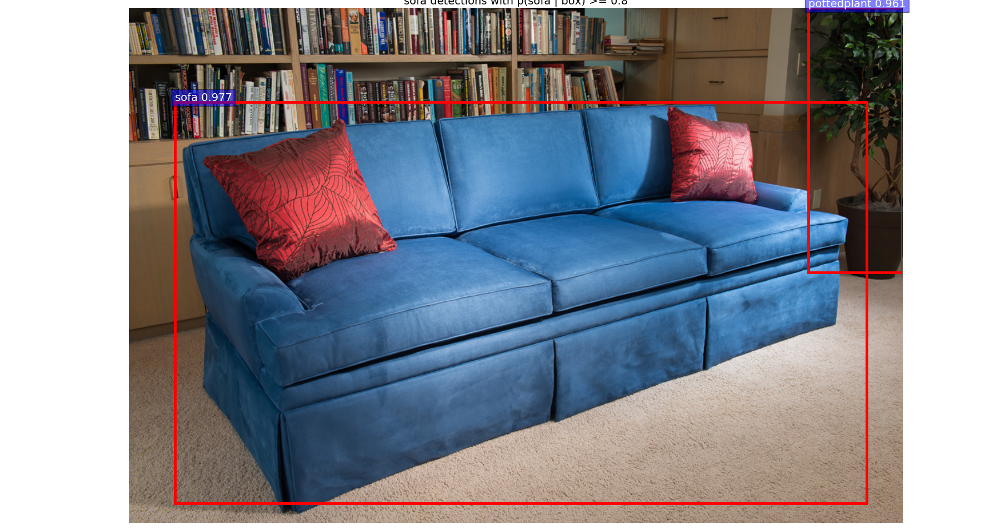
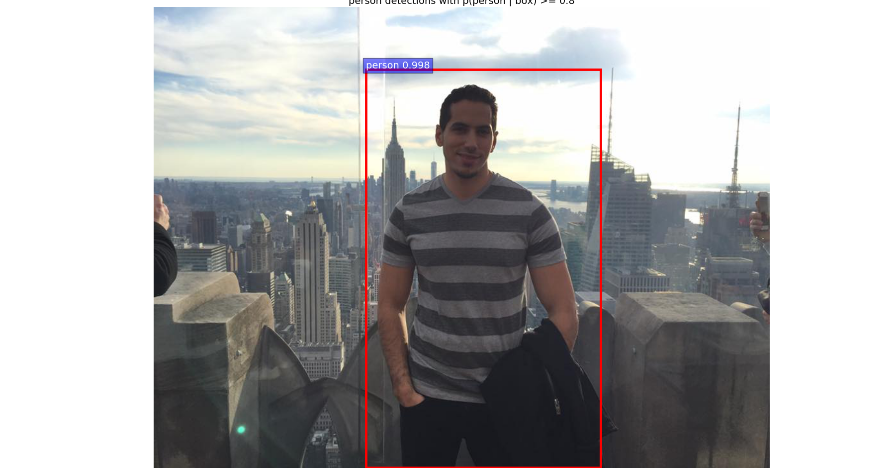

Object detection using faster RCNN in TensorFlow
================================================

## Network Diagram

The following diagram describes the pipeline the image goes through in order to retrieve:

1. rois: The regions of interest that feed into the rest of the network to get the bounding boxes, the scores and the probabilities.
The image passes through the main part of the pipeline (a sequence of convolution followed by max pool that grows in size from 64 to 512).
Following that the output is taken and fed into the part of the network that outputs regions of interest.

2. bbox_pred: Which are the bounding boxes predictions.
The image passes through the main pipeline (a sequence of convolution followed by max pool that grows in size from 64 to 512), then the output of that pipeline and the output of the regions of interest are fed into two fully connected network of size 4096 to output the bounding boxes predictions.

3. cls_score: The score for each bounding box to be of a certain class.
The pipeline continues from bounding box predictions into another fully connected network of size 21 (corresponding to the 21 classes we have for detection) to output the score for each one of them.

4. cls_prob: The probability for each bounding box to be of a certain class.
The pipeline continues from the cls_score to a softmax to give the probability for each of the 21 classes.

## Code

The code in tools/main.py does the following:

1. Loads the network described above
2. Loads the image
3. Runs detect on the loaded image, which gives scores and boxes of the object detections.
4. Runs visualize given those scores and boxes to draw on the image the detections if they pass the threshold.

Detect does the following:

1. Preprocess the loaded image by subtracting the mean from the pixel values
2. Resize the image to 600 x 600
3. Prepare the input to the network which are: data which is the output from the previous step (after resize) and im_info which includes the image shape information
4. Feeds the network with the data and retrieve cls_prob, bbox_pred, rois
5. Adjust the boxes from the scale performed on the image
6. Calculate the bounding boxes x1, y1, x2, y2 from the output
7. Clip the result from 6 to verify it is within the bounds of the image
8. return the probabilities and the bounding boxes

Visualize does the following:

1. For each class, gets the highest probabilities and dismiss anything below a threshold of 0.8
2. For the those that are above that threshold, draw the bounding boxes on the image

## Object Detections

The following image shows a sofa being detected:

The following image shows another sofa being detected:

The following image shows a person being detected:

## Credits

This project is to learn more about object detection using [Faster RCNN](https://arxiv.org/pdf/1506.01497v3.pdf).
The work here is inspired from [here](https://github.com/smallcorgi/Faster-RCNN_TF).
